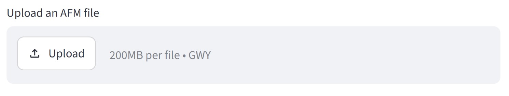
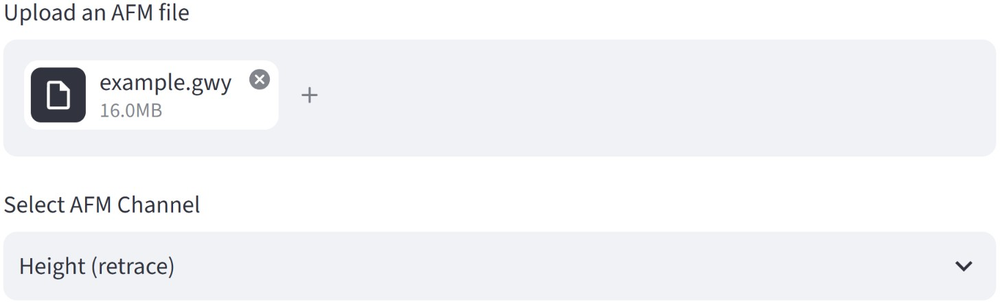
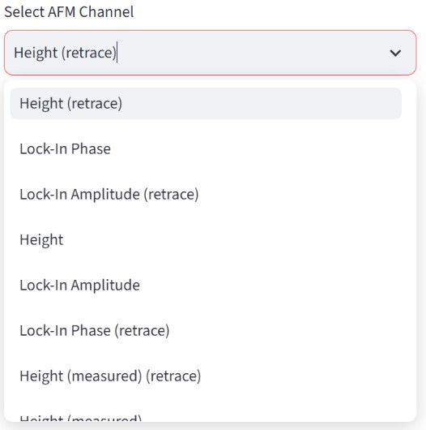
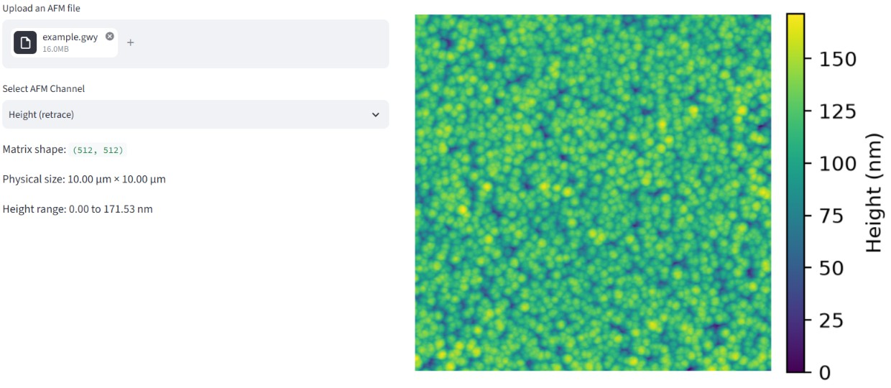

# Overview

This guide provides the basic instructions for using the AFM Grain Analysis web application. The application allows users to upload AFM data, select the appropriate data channel, adjust the grain-detection parameters, review the detected grains, and download the resulting grain mask and statistical analysis.

# Accessing the Application

The AFM Grain Analysis tool is available online through the Streamlit web application:

[Open AFM Grain Analysis](https://ichilab-grain-analysis.streamlit.app/)

No local installation of Python or additional software is required to use the web application.

# Uploading AFM Data

Use **Upload an AFM file** to select the AFM file to be analyzed.

The application currently accepts files in the Gwyddion `.gwy` format.

After the file is uploaded, the application will display the available AFM data channels.

# Selecting the AFM Channel

Use **Select AFM Channel** to choose the data channel that will be used for the grain analysis.

After selecting a channel, the application displays:

- The dimensions of the data matrix
- The physical dimensions of the scanned area
- The height range
- A preview of the selected AFM image

Verify that the correct channel has been selected before adjusting the grain-detection parameters.

# Detection Settings

The **Detection settings** section contains the parameters used to control grain-boundary detection.

The parameters are divided into three groups:

## 3×3 Processing

**Threshold sensitivity**

Controls the selectivity of the initial boundary detection performed using the 3×3 processing path.

**Minimum component size**

Removes small detected components below the specified size.

## 9×9 Processing

**Threshold sensitivity**

Controls the selectivity of the initial boundary detection performed using the 9×9 processing path.

**Minimum component size**

Removes small detected components below the specified size.

## Reconstruction and Cleaning

**Endpoint trace steps**

Controls the number of pixels used to estimate the direction of incomplete grain boundaries.

**Maximum complement steps**

Controls the maximum distance over which the algorithm can extend an incomplete boundary using information from the complementary detection path.

**Minimum cycle size**

Removes small closed structures below the specified size from the final grain-boundary mask.

# Reviewing the Binary Mask

The **Binary mask** preview updates when the detection parameters are changed.

Use this preview to evaluate whether the detected boundaries adequately represent the grain structure of the AFM image.

Adjust the detection parameters as necessary before proceeding to the final results.

# Reviewing the Analysis Results

The **Analysis results** section displays the grains identified from the final grain-boundary mask.

Grains that intersect the image borders are excluded from the final analysis because their complete dimensions cannot be determined from the available image.

The application also displays a table containing the calculated properties for each valid grain.

# Downloading Results

After reviewing the grain detection and statistical results, the final outputs can be downloaded from the **Download results** section.

The available outputs are:

- **Grain statistics CSV:** Contains the calculated properties for each analyzed grain.
- **Binary grain mask PNG:** Contains the final binary mask of the valid detected grains.

The downloaded files use the original AFM filename as the base of the output filename.